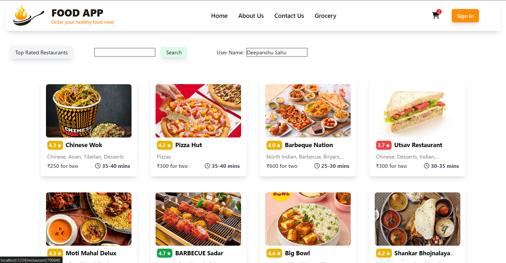

# Food App Frontend &nbsp;&nbsp;&nbsp;[Live link](https://food-app.deepanshu-sahu-projects.live/)




## Description

The Food App is a web application that allows users to browse restaurants, view menus, and place orders. This repository contains the frontend code built with React and Tailwind CSS. **The application uses the Swiggy Live API to fetch real-time restaurant data.**

## Features

1. **Responsive Design**: 
    - The application is fully responsive and adapts to different screen sizes using Tailwind CSS.

2. **Restaurant Listing**: 
    - Browse a list of restaurants with images, names, cuisines, delivery time, and cost for two.

3. **Hover Animations**: 
    - Smooth hover animations and dynamic styles enhance the user experience.

4. **Carousel**:
    - Add a carousel to display restaurant images form the provied data from swiggy apis. Implemented scrolling 
      through button click with useRef hook and custom event listeners on scroll. 

5. **Mock Backend**
    - Created a mock swiggy backend to bypass swiggy's cors policy.

6. **Infinite Scroll**: 
    - Implement infinite scroll using the Swiggy update API to dynamically load more restaurants as users 
      scroll down the page.

7. **User Authentication**: 
    - Enable user authentication to allow users to create accounts, log in, and manage their profiles. Used 
     MongoDB in backend to store data and Jwt token for authentication.

8. **Cart Functionality**: 
    - Enhance the cart functionality to allow users to add, remove, and modify items in their cart. This will 
      include features like updating quantities, viewing total costs, and proceeding to checkout.

9. **Add Toasts**:
    - Add toast to wherever there is requirement for alert or message is necessary for user using react     
      toastify.
 
## Upcoming Features

1. **Location-Based Restaurant Listing**: 
    - Use the user's geographical coordinates (longitude and latitude) to provide a list of nearby restaurants. 
      This feature will leverage location services to ensure users see the most relevant dining options based 
      on their current location.

2. **Additional Filters**: 
    - Add advanced filtering options to help users narrow down restaurant choices based on criteria such as 
      rating, cuisine type, delivery time, cost for two, etc.

3. **Admin Dashboard**:
    - To give you a comprehensive overview and quick insights through various metrics and performance indicators and manage data.


## Technologies Used

- React
- Node
- Tailwind CSS
- FontAwesome for icons
- React Router for navigation
- **Swiggy Live API** for fetching restaurant data
- **Parcel Bundler**: For Efficient bundling of the project for development and production.
- Redux
- React Toastify
- MongoDB
- JWT Token

## Getting Started

### Prerequisites

Before running the project, ensure you have the following installed:

- Node.js (v12 or higher)
- npm (v6 or higher) or yarn (v1.22 or higher)

### Installation

1. **Clone the repository:**
   ```bash
   git clone https://github.com/dee077/food-app-frontend.git
   cd Food-App-FE
   ```

2. **Install Dependencies:**
    ```bash
    npm install
    ```

3. **Run Application:**
    ```bash
    npm start
    ```

### Contributing

If you would like to contribute to this project, please feel free to fork the repository, create a new branch, and submit a pull request with your changes. Contributions are always welcome!
